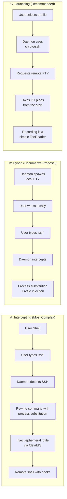
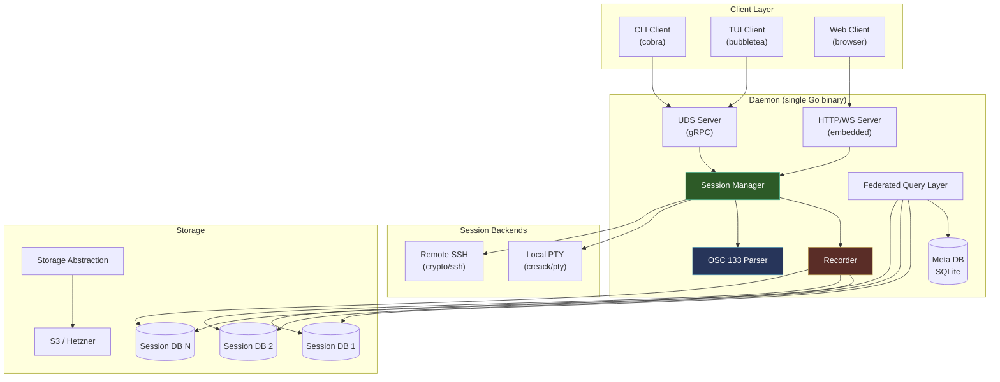

# Architectural Critique: Terminal Session Management Platform

## The Central Question You're Really Asking

Your [discussion.md](file:///app/projects/advanced-dada-system/llm/discussion.md) describes a **hybrid** session model: the platform *launches* local sessions (PTY wrapper) but *intercepts* SSH transitions within those sessions by detecting when the user types `ssh`, rewriting the command with process substitution, and injecting an ephemeral rcfile. This hybrid is **the most architecturally complex option**. Your instinct to question it is correct.

The real question is:

> **Should the platform OWN sessions from birth (launching model) or WRAP existing workflows (intercepting model)?**

The answer, especially for a solo developer with LLM assist, is unambiguous: **own them**.

---

## The Three Models, Compared



| Dimension | Intercepting | Hybrid (Document) | **Launching (Recommended)** |
|---|---|---|---|
| **Complexity** | Extreme | Very High | **Moderate** |
| **Recording guarantee** | Fragile — race conditions | Better locally, fragile remotely | **100% — you own the pipe** |
| **Bash process substitution** | Required | Required for remote | **Not needed** |
| **Shell compatibility** | Bash-only (rcfile) | Bash-only for remote | **Shell-agnostic** |
| **User evasion** | Easy (`unset PROMPT_COMMAND`) | Easy remotely | **Impossible — daemon IS the terminal** |
| **SSH feature parity** | Full (user's own ssh) | Full locally | **Must reimplement key features** |
| **Solo dev feasibility** | 🔴 | 🟡 | **🟢** |

---

## Why `crypto/ssh` Eliminates Process Substitution

The document's approach for remote tracking is:

```bash
ssh -t user@remote 'exec bash --rcfile /dev/fd/3 3<<< "$(printf "%s" "$INJECTED_PAYLOAD")"'
```

This is clever but **fragile for six reasons**:

1. **Bash-only** — fails if the remote default shell is `zsh`, `fish`, or `sh`
2. **Process substitution is bash-specific** — `<(...)` doesn't exist in POSIX sh
3. **Escaping hell** — the payload must survive multiple levels of shell quoting
4. **Race condition** — between shell start and hook activation, the user can type commands
5. **User can escape** — `exec bash --norc` or `unset PROMPT_COMMAND` kills tracking
6. **Requires local `ssh` binary** — daemon must parse and rewrite the command

With Go's `golang.org/x/crypto/ssh`, **none of this is necessary**:

```go
// The daemon establishes the SSH connection directly
client, _ := ssh.Dial("tcp", "host:22", sshConfig)
session, _ := client.NewSession()

// Request a PTY on the remote end
session.RequestPty("xterm-256color", rows, cols, termModes)

// Get the I/O pipes — these ARE your recording points
stdin, _  := session.StdinPipe()   // io.WriteCloser
stdout, _ := session.StdoutPipe()  // io.Reader

// Recording is just wrapping the pipes
timedRecorder := NewTimestampedWriter(sessionDB)
recordedOut := io.TeeReader(stdout, timedRecorder)

// Inject shell integration BEFORE handing control to the user
session.Shell()
stdin.Write([]byte("source /dev/stdin <<'__SHELL_HOOKS__'\n"))
stdin.Write([]byte(shellIntegrationScript)) // OSC 133 markers, PROMPT_COMMAND
stdin.Write([]byte("\n__SHELL_HOOKS__\n"))

// Now relay user I/O through the daemon
go io.Copy(userTerminal, recordedOut)  // remote → user (recorded)
io.Copy(stdin, userInput)              // user → remote
```

> [!IMPORTANT]
> The daemon **is** the SSH client. It doesn't spawn `ssh`, doesn't need to intercept commands, doesn't need process substitution. It owns every byte flowing in both directions from the moment the connection is established.

### What You Lose (and How to Mitigate)

| Lost Feature | Mitigation |
|---|---|
| User's `~/.ssh/config` parsing | Use `github.com/kevinburke/ssh_config` to parse it natively in Go |
| SSH agent forwarding | Implement via `ssh.ForwardToRemote()` + `agent.ForwardToAgent()` |
| ProxyJump / bastion chains | Implement multi-hop via `client.Dial()` to next hop |
| User typing `ssh` within a session | Wrap `ssh` as a shell function in the injected hooks that calls back to the daemon (Phase 2+) |
| `~/.ssh/known_hosts` | Use `github.com/skeema/knownhosts` for strict host key verification |

These are **well-scoped, independently implementable features** — far easier than debugging process substitution edge cases across shell variants.

---

## The PTY Is Unavoidable — But Ownership Changes Everything

You asked about alternatives to the PTY wrapper. Here's the critical insight:

> **The PTY is not optional.** Interactive programs (vim, htop, less) require a real terminal. The question is not *whether* to use a PTY, but *who owns it*.

### Ownership Model Comparison

**Document's approach** (PTY as transparent proxy):
```
User Terminal ←→ [Daemon PTY Proxy] ←→ Shell ←→ ssh ←→ Remote Shell
                  ↓ recording
```
The daemon wraps the user's existing terminal with a PTY proxy layer. This means:
- The daemon must handle the user's raw terminal state
- It must detect SSH transitions mid-stream
- It must inject hooks through the PTY pipe itself

**Recommended approach** (Daemon as terminal backend):
```
TUI/Web Client ←→ [Daemon] ←→ PTY ←→ Local Shell
                      ↓
                   [Daemon] ←→ crypto/ssh channel ←→ Remote PTY ←→ Remote Shell
                      ↓
                   SQLite (recording is just I/O tee)
```
The daemon IS the terminal emulator backend. The user connects to the daemon via TUI, CLI, or Web. This means:
- **Local sessions**: `creack/pty` spawns a shell, daemon reads/writes the master fd
- **Remote sessions**: `crypto/ssh` opens a channel, daemon reads/writes the channel pipes
- **Recording**: In both cases, `io.TeeReader` on the output stream writes timestamped data to SQLite
- **No interception needed**: The daemon sees everything because it IS the pipeline

### The Recording Pattern (Both Local and Remote)

```go
// === Common recording interface ===
type SessionRecorder struct {
    db        *sql.DB       // per-session SQLite
    startTime time.Time
    mu        sync.Mutex
}

func (r *SessionRecorder) Write(p []byte) (int, error) {
    r.mu.Lock()
    defer r.mu.Unlock()
    elapsed := time.Since(r.startTime).Seconds()
    _, err := r.db.Exec(
        "INSERT INTO io_stream (timestamp, elapsed, stream_type, data) VALUES (?, ?, 'stdout', ?)",
        time.Now().UnixMilli(), elapsed, p,
    )
    return len(p), err
}

// === Local session ===
func startLocalSession(shell string, recorder *SessionRecorder) {
    cmd := exec.Command(shell, "--rcfile", shellIntegrationPath)
    ptmx, _ := pty.Start(cmd)
    recorded := io.TeeReader(ptmx, recorder) // <-- recording happens here
    go io.Copy(clientConn, recorded)          // daemon → TUI/Web
    io.Copy(ptmx, clientConn)                 // TUI/Web → shell
}

// === Remote session ===
func startRemoteSession(host string, recorder *SessionRecorder) {
    client, _ := ssh.Dial("tcp", host+":22", sshConfig)
    session, _ := client.NewSession()
    session.RequestPty("xterm-256color", 80, 24, termModes)
    stdout, _ := session.StdoutPipe()
    stdin, _  := session.StdinPipe()
    session.Shell()
    
    recorded := io.TeeReader(stdout, recorder) // <-- identical recording
    go io.Copy(clientConn, recorded)            // daemon → TUI/Web
    io.Copy(stdin, clientConn)                  // TUI/Web → remote shell
}
```

> [!TIP]
> Notice: local and remote recording use **the exact same pattern**. The only difference is the I/O source (`ptmx` vs `stdout`/`stdin` pipes). This is a massive simplification over the document's approach, where local and remote sessions have completely different capture mechanisms.

---

## OSC 133: Shell Integration Without Process Substitution

The document's OSC 133 injection approach via process substitution still works — you just deliver it differently.

### For Local Sessions (Ghostty's Approach)

Instead of injecting via process substitution, use the `ENV` variable trick (exactly what Ghostty does):

```go
// Write shell integration script to a known location
integrationScript := `
# Preserve user's existing rc
[ -f ~/.bashrc ] && source ~/.bashrc

# OSC 133 semantic markers
__osc133_prompt_start() { printf '\e]133;A\a'; }
__osc133_input_start()  { printf '\e]133;B\a'; }
__osc133_output_start() { printf '\e]133;C\a'; }
__osc133_command_end()  { printf '\e]133;D;%s\a' "$?"; }

PROMPT_COMMAND='__osc133_command_end; __osc133_prompt_start'
PS0='$(__osc133_output_start)'
PS1="${PS1}\[\$(__osc133_input_start)\]"
`
os.WriteFile(integrationPath, []byte(integrationScript), 0600)

// Launch bash with ENV pointing to integration script
cmd := exec.Command("bash", "--rcfile", integrationPath)
// For POSIX sh:
cmd.Env = append(os.Environ(), "ENV="+integrationPath)
```

### For Remote Sessions (via crypto/ssh stdin injection)

```go
session.Shell()

// Inject hooks immediately via stdin — no process substitution needed
hookPayload := fmt.Sprintf("eval \"$(%s)\"\n", base64EncodedHooks)
stdin.Write([]byte(hookPayload))
// Or use heredoc:
stdin.Write([]byte("source /dev/stdin <<'__HOOKS__'\n"))
stdin.Write([]byte(shellIntegrationScript))
stdin.Write([]byte("\n__HOOKS__\n"))
```

### For Zsh Remote Sessions

```go
// Zsh uses precmd/preexec natively — much cleaner
zshHooks := `
autoload -Uz add-zsh-hook
__osc133_precmd()  { printf '\e]133;D;%s\a\e]133;A\a' "$?"; }
__osc133_preexec() { printf '\e]133;C\a'; }
add-zsh-hook precmd  __osc133_precmd
add-zsh-hook preexec __osc133_preexec
`
```

> [!NOTE]
> The OSC 133 markers are still the right approach for semantic segmentation. What changes is the **delivery mechanism** — stdin injection via owned SSH channel instead of bash process substitution via intercepted command.

---

## Architectural Critique: What the Document Gets Right and Wrong

### ✅ Sound Decisions (Keep These)

| Decision | Why It's Right |
|---|---|
| **Database-per-session SQLite** | Elegant isolation, trivial archival, avoids write contention. The Federated Access Layer on top is the correct abstraction. |
| **OSC 133 semantic markers** | Industry standard (Ghostty, WezTerm, Kitty, iTerm2 all use them). Essential for LLM RAG quality. |
| **FTS5 for full-text search** | Built into SQLite, zero external dependencies, fast enough for terminal-scale data. |
| **HashiCorp go-plugin model** | Battle-tested (Terraform, Vault, Packer). gRPC-over-UDS with mTLS is the gold standard for plugin isolation. |
| **WAL mode for concurrent access** | Correct — allows the TUI/Web to read while the session writes without blocking. |
| **Storage abstraction layer** | Interface-driven storage is essential. The Hetzner-specific drivers (SFTP port 23, WebDAV) are practical. |
| **Ansible Runner artifact events** | The structured JSON event approach is absolutely correct — stdout scraping is indeed unusable. |
| **OS keyring for secrets** | Never store secrets in SQLite. `keyring-rs`/`secret-rs` → Go equivalent: `github.com/zalando/go-keyring`. |

### ⚠️ Questionable Decisions (Revisit These)

#### 1. Bash Process Substitution for Remote Tracking
**Problem:** As detailed above — fragile, bash-only, escaping nightmare, user-evadable.
**Alternative:** `crypto/ssh` direct connection with stdin-based hook injection.

#### 2. Intercepting SSH Within Active Sessions
**Problem:** Requires command parsing, pattern matching on the PTY stream (what if the user aliases ssh? uses sshpass? uses a wrapper script?), and real-time command rewriting. This is a **state machine nightmare**.
**Alternative:** The platform provides explicit "connect to remote host" actions. Profile-based connection management. For users who type `ssh` within a session, the session still records the raw I/O — they just don't get semantic segmentation of the remote commands. This is an acceptable degradation for v1.

#### 3. tmux Control Mode as Core Dependency
**Problem:** tmux Control Mode is powerful but:
- Its text protocol is **not formally specified** — you're parsing output from a tool that considers its control protocol an implementation detail
- It adds a hard runtime dependency
- Session persistence via tmux means your daemon can't manage sessions if tmux crashes

**Recommendation:** Make tmux integration **optional** (Phase 3+). The core daemon can manage sessions with plain PTY pairs and `crypto/ssh` channels. Basic detach/reattach is achievable with a scrollback buffer and a virtual terminal state tracker (see `github.com/danielgatis/go-vte`). tmux Control Mode becomes a premium feature for power users who want advanced multiplexing.

#### 4. Litestream/Verneuil for Real-Time Replication
**Problem:** Embedding a VFS shim or WAL interceptor adds significant complexity and is a **second-order concern**. For a solo developer, this is premature.
**Alternative (Phase 6+):** Start with periodic `sqlite3 .backup` to the storage abstraction layer. Graduate to Litestream when you've proven the core works. Litestream is a standalone binary that watches SQLite files externally — you don't need to embed it.

#### 5. "The Software Intercepts the Execution" (of SSH commands)
**Problem:** The document says "When a user initiates an SSH connection from within an active local terminal session, the system intercepts the execution." This implies monitoring the PTY stream for SSH invocations in real-time. This is:
- A parsing problem (regex on binary PTY streams with ANSI codes mixed in)
- A timing problem (must intercept before the SSH binary actually starts)
- Architecturally, this is what **eBPF** or **ptrace** is for — not PTY stream analysis

**Alternative:** Don't intercept. Launch. If the user types `ssh` in a raw session, it works normally (untracked remote context). If they want tracked remote sessions, they use the platform's profile system.

### ❌ Missing Pieces (Add These)

| Gap | Why It Matters |
|---|---|
| **SIGWINCH handling** | Terminal resize must propagate: client → daemon → PTY/SSH channel. Without this, vim/htop break on resize. |
| **SSH `known_hosts` verification** | The document doesn't address host key verification. Use `github.com/skeema/knownhosts` to parse the user's existing known_hosts file. |
| **SSH config parsing** | Users expect their `~/.ssh/config` to work (IdentityFile, ProxyJump, etc.). Use `github.com/kevinburke/ssh_config`. |
| **SSH agent forwarding** | Critical for users who chain SSH connections. `golang.org/x/crypto/ssh/agent` supports this. |
| **Asciicast format for recording** | The document mentions "millisecond timestamps" but doesn't specify a recording format. Use asciicast v2/v3 — it's the industry standard, trivial to implement, and every replay tool supports it. |
| **Graceful degradation** | What happens when the daemon crashes mid-session? The PTY child process gets SIGHUP. Document recovery strategy. |

---

## Revised Architecture for a Solo Go Developer



### Core Go Package Structure

```
cmd/
  ads/              # CLI + daemon entrypoint ("Advanced Dada System")
    main.go

internal/
  daemon/           # Core daemon lifecycle, UDS/HTTP server
    daemon.go
    server.go

  session/          # Session manager — the heart of the system
    manager.go      # Create, list, attach, detach, kill sessions
    local.go        # Local PTY sessions (creack/pty)
    remote.go       # Remote SSH sessions (crypto/ssh)
    recorder.go     # io.TeeReader-based recording + timestamps
    osc133.go       # OSC 133 parser/emitter

  database/         # SQLite layer
    meta.go         # Internal meta-database
    session_db.go   # Per-session database provisioning
    federated.go    # Cross-session query abstraction
    fts.go          # FTS5 search interface

  storage/          # Storage abstraction
    interface.go    # Read/Write/List/Delete interface
    local.go        # Local filesystem
    s3.go           # S3-compatible (AWS, MinIO, Hetzner Object Storage)
    sftp.go         # SFTP (Hetzner Storage Boxes)

  profile/          # Entity and profile management
    profile.go
    credential.go   # OS keyring integration (go-keyring)

  shell/            # Shell integration scripts
    bash.sh         # OSC 133 hooks for bash
    zsh.sh          # OSC 133 hooks for zsh
    fish.sh         # OSC 133 hooks for fish
    embed.go        # go:embed the scripts

  tui/              # Terminal UI (bubbletea)
    app.go
    session_list.go
    session_view.go
    search.go

  web/              # Web interface
    server.go       # HTTP + WebSocket server
    handlers.go
    static/         # Embedded frontend assets

  plugin/           # Plugin system (Phase 5)
    host.go         # go-plugin host
    proto/          # gRPC protobuf definitions

  ansible/          # Ansible integration (Phase 7)
    runner.go
```

---

## Phased Delivery Plan

### Phase 0: Vertical Spike (1–2 weeks)
**Goal:** Prove the two hardest technical risks in throwaway code.

| Spike | What to Prove |
|---|---|
| **Spike A** | Can you spawn a local bash session via `creack/pty`, inject OSC 133 hooks via `--rcfile`, record all I/O with timestamps, parse the OSC markers, and store structured data in SQLite? Does vim/htop work? |
| **Spike B** | Can you connect to a remote host via `crypto/ssh`, request a PTY, inject hooks via stdin, record I/O, and handle SIGWINCH? |

**Deliverable:** Two standalone Go programs, <500 lines each, that prove the concept works. Delete them after.

### Phase 1: Core Daemon + Local Sessions (3–4 weeks)
- Headless daemon with Unix Domain Socket (gRPC or plain protocol)
- Local PTY session management via `creack/pty`
- Session recording with timestamps → single SQLite DB (not per-session yet)
- OSC 133 injection via `--rcfile` (bash) and `ZDOTDIR` (zsh)
- CLI client: `ads start`, `ads list`, `ads attach <id>`, `ads search <query>`
- Basic session replay: `ads replay <id>`

> [!TIP]
> **Ship this.** A local session recorder with search is already useful. Use it daily for your own work from this point forward — eat your own dog food.

### Phase 2: Remote Sessions + Context Tracking (3–4 weeks)
- SSH connection management via `crypto/ssh`
- SSH config parsing (`kevinburke/ssh_config`)
- Remote PTY allocation + SIGWINCH forwarding
- stdin-based hook injection for remote shells
- Context switch tracking (local → remote as separate session entities)
- Database-per-session model (provision `.db` file per session)
- Profile system: server entities with credentials (OS keyring via `go-keyring`)

### Phase 3: TUI + Search (3–4 weeks)
- `bubbletea`-based TUI with session list, search, real-time view
- FTS5 integration for cross-session full-text search
- Federated query layer (meta-DB indexes → targeted session DB queries)
- Session tagging and filtering (by server, date, customer)
- *Optional:* tmux Control Mode integration for multiplexing

### Phase 4: Containers + Storage (3–4 weeks)
- Podman API integration for container management
- Container-based execution environments
- Storage abstraction layer (local FS + S3)
- Hetzner-specific backends (Object Storage, Storage Box SFTP)
- Periodic backup of session DBs to remote storage

### Phase 5: Plugin System + LLM Service (3–4 weeks)
- HashiCorp go-plugin architecture (gRPC over UDS)
- LLM service plugin: RAG over structured session data
- Time-tracking service plugin
- Plugin lifecycle management in the daemon

### Phase 6: Web Interface (3–4 weeks)
- Embedded HTTP + WebSocket server in the daemon
- Browser-based terminal (xterm.js or similar)
- Profile/entity management UI
- LLM chat interface
- Billing report generation

### Phase 7: Ansible + Polish (2–3 weeks)
- Ansible Runner integration with Execution Environments
- Structured event capture from Runner artifacts
- Litestream real-time replication (if needed)
- Comprehensive backup/restore system

---

## Risk Matrix

| Risk | Severity | Likelihood | Mitigation |
|---|---|---|---|
| PTY I/O fidelity (vim/htop broken) | 🔴 Critical | Low | Spike A proves this early. `creack/pty` is battle-tested. |
| Shell hook injection fails on exotic shells | 🟡 Medium | Medium | Support bash + zsh first. Fish and others are Phase 3+. Degrade gracefully (record raw I/O without semantic markers). |
| `crypto/ssh` feature gaps (ProxyJump, agent forwarding) | 🟡 Medium | Medium | Libraries exist for each gap. Implement incrementally as needed. |
| SQLite federation performance at scale (1000s of DBs) | 🟡 Medium | Low | The meta-DB index + targeted attachment is the right pattern. Benchmark with 1000 DBs in Phase 3. |
| tmux Control Mode parsing complexity | 🟡 Medium | High | **This is why tmux should be optional.** Don't block the core on tmux integration. |
| Solo developer burnout on scope | 🔴 Critical | High | Strict phasing. Ship Phase 1 first. Use it daily. Only advance when the current phase is stable. |

---

## Key Library Recommendations (Go)

| Concern | Library | Why |
|---|---|---|
| Local PTY | [`creack/pty`](https://github.com/creack/pty) | The standard. Stable, widely used, simple API. |
| Terminal raw mode | [`golang.org/x/term`](https://pkg.go.dev/golang.org/x/term) | Official Go extended library. |
| SSH client | [`golang.org/x/crypto/ssh`](https://pkg.go.dev/golang.org/x/crypto/ssh) | Full SSH client with PTY support. |
| SSH config | [`kevinburke/ssh_config`](https://github.com/kevinburke/ssh_config) | Parse `~/.ssh/config` natively. |
| SSH known_hosts | [`skeema/knownhosts`](https://github.com/skeema/knownhosts) | Strict host key verification. |
| SSH agent | [`golang.org/x/crypto/ssh/agent`](https://pkg.go.dev/golang.org/x/crypto/ssh/agent) | Agent forwarding support. |
| SQLite | [`modernc.org/sqlite`](https://pkg.go.dev/modernc.org/sqlite) or [`mattn/go-sqlite3`](https://github.com/mattn/go-sqlite3) | Pure Go vs CGo. Pure Go (`modernc`) for easier cross-compilation; CGo (`mattn`) for FTS5 and performance. |
| TUI | [`charmbracelet/bubbletea`](https://github.com/charmbracelet/bubbletea) | The Go TUI framework. Rich ecosystem (lipgloss, bubbles). |
| CLI | [`spf13/cobra`](https://github.com/spf13/cobra) | Standard Go CLI framework. |
| gRPC | [`google.golang.org/grpc`](https://pkg.go.dev/google.golang.org/grpc) | For daemon ↔ client and plugin communication. |
| Plugins | [`hashicorp/go-plugin`](https://github.com/hashicorp/go-plugin) | Battle-tested plugin system. |
| OS keyring | [`zalando/go-keyring`](https://github.com/zalando/go-keyring) | Cross-platform keyring access. |
| Podman | [`containers/podman/pkg/bindings`](https://github.com/containers/podman) | Official Go bindings for Podman API. |
| S3 | [`aws/aws-sdk-go-v2`](https://github.com/aws/aws-sdk-go-v2) | Works with any S3-compatible API (Hetzner, MinIO). |
| SFTP | [`pkg/sftp`](https://github.com/pkg/sftp) | SFTP client for Hetzner Storage Boxes. |

---

## Summary of Recommendations

1. **Use the launching model** — the daemon owns all sessions from birth, both local (PTY) and remote (crypto/ssh). No interception.
2. **Drop bash process substitution** — inject shell hooks via `--rcfile` locally and stdin injection remotely. The daemon owns the pipes, so delivery is trivial.
3. **Recording is identical for local and remote** — `io.TeeReader` on the output stream, `TimestampedWriter` to SQLite. One pattern, two backends.
4. **Make tmux optional** — the core daemon manages sessions with plain PTY pairs. tmux Control Mode is a power-user addon, not a foundation.
5. **Defer Litestream** — start with periodic `.backup`, graduate to WAL streaming when the core is proven.
6. **Ship Phase 1 in 3–4 weeks** — a local session recorder with search is already useful. Eat your own dog food.
7. **The "seamless SSH detection" can come later** — if a user types `ssh` in a raw session, it records as raw I/O. Tracked remote sessions go through the profile system. This is an acceptable v1 trade-off that eliminates the most complex subsystem in the entire design.
