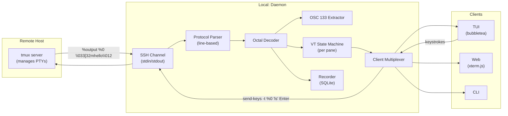
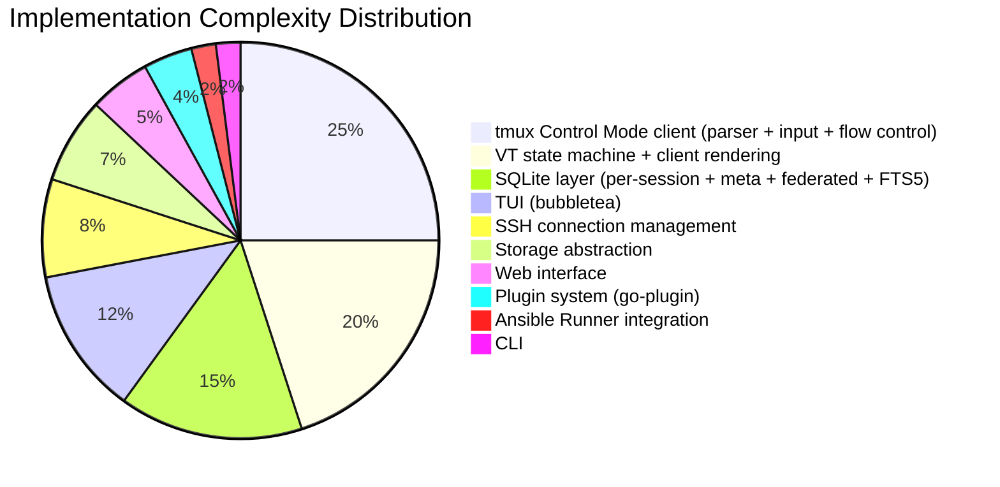

# Architectural Critique — Revised Blueprint (v2)

> Reviewing: [Architectural Blueprint for a Container-Native, Multi-Modal Terminal Session Management and Analytics Platform](file:///app/projects/advanced-dada-system/llm/Architectural%20Blueprint%20for%20a%20Container-Native,%20Multi-Modal%20Terminal%20Session%20Management%20and%20Analytics%20Platform.md)

---

## What Changed and Why It's Stronger

The revised document makes three decisive architectural simplifications over the [original discussion.md](file:///app/projects/advanced-dada-system/llm/discussion.md):

| Change | Before | After | Impact |
|---|---|---|---|
| **Terminal backend** | Custom PTY wrapper via `creack/pty` + ioctl | tmux Control Mode (`-CC`) | Offloads all PTY management to tmux. Eliminates low-level PTY code. |
| **Remote sessions** | Intercept SSH within active sessions via bash process substitution | Explicitly launched as separate entities through profiles | Eliminates the most fragile subsystem (command rewriting, rcfile injection, shell-specific hacks). |
| **Remote capture** | Ephemeral rcfile + process substitution + PROMPT_COMMAND hooks | tmux `-CC` over SSH, structured `%output` protocol | Identical capture mechanism for local and remote. One parser, two transports. |

These changes are sound. The document is tighter (107 lines vs 172), more internally consistent, and the complexity budget is allocated to the right places. The rest of this critique evaluates the revised architecture on its own terms.

---

## tmux Control Mode as Foundation — Validated With Caveats

Research confirms that tmux Control Mode is a viable programmatic terminal backend. Here's what the architecture is actually committing to:

### What the Daemon Must Be

The document states the daemon receives `%output` blocks and ingests them into SQLite. This undersells the actual responsibility. Because Control Mode does not render anything, **the daemon IS a terminal emulator**. It must:

1. **Parse** the tmux control protocol (line-based, `%`-prefixed notifications)
2. **Decode** octal-encoded output (`\033` → `0x1B`, `\012` → `\n`, `\134` → `\`)
3. **Maintain virtual terminal state** per pane (cursor position, colors, alternate screen buffer) for reattach/replay
4. **Forward decoded output** to TUI/Web clients
5. **Accept user input** from clients and translate to `send-keys` commands via tmux stdin
6. **Manage flow control** — consume `%output` fast enough to avoid `%pause` / disconnection



> [!IMPORTANT]
> The document should explicitly acknowledge that the daemon functions as a **terminal emulator** that speaks the tmux control protocol. This is the single largest implementation effort in the system — larger than the SQLite layer, the storage abstraction, or the plugin system. Plan accordingly.

### The Protocol Parser Is Simple

The control mode protocol is line-oriented with no nested structures. A Go parser is straightforward:

```go
// Core parsing loop — ~200 lines for a complete implementation
scanner := bufio.NewScanner(tmuxStdout)
for scanner.Scan() {
    line := scanner.Text()
    switch {
    case strings.HasPrefix(line, "%output "):
        paneID, encoded := parseOutput(line) // split at second space
        decoded := unescapeOctal(encoded)     // \033 → 0x1B, \012 → \n
        s.handleOutput(paneID, decoded)
    case strings.HasPrefix(line, "%begin "):
        s.beginResponse(line)
    case strings.HasPrefix(line, "%end "):
        s.endResponse(line)
    case strings.HasPrefix(line, "%error "):
        s.errorResponse(line)
    case strings.HasPrefix(line, "%exit"):
        s.handleExit(line)
    case strings.HasPrefix(line, "%window-add "):
        s.handleWindowAdd(line)
    case strings.HasPrefix(line, "%window-close "):
        s.handleWindowClose(line)
    case strings.HasPrefix(line, "%layout-change "):
        s.handleLayoutChange(line)
    case strings.HasPrefix(line, "%pause "):
        s.handlePause(line)
    case strings.HasPrefix(line, "%continue "):
        s.handleContinue(line)
    }
}
```

The main subtlety is **octal unescaping**: all characters below ASCII 32 are encoded as `\xxx` (3-digit octal), and backslash itself becomes `\134`. This is well-defined and deterministic.

### No Existing Go Library

No Go library currently parses the tmux control mode protocol. The existing Go tmux bindings (`gotmux`, `owenthereal/tmux`) shell out to `tmux` commands rather than speaking the control protocol. **You will build the first Go control mode client.** This is a feature, not a problem — it's a well-scoped, testable component.

---

## OSC 133 Through tmux Control Mode — Validated

This was the critical question. Research confirms:

> **OSC 133 sequences ARE preserved in `%output` blocks.** They arrive octal-encoded, not stripped.

The flow:

1. Shell emits `\x1b]133;A\x07` (prompt start marker)
2. tmux's internal VT receives it. Since tmux 3.4+, tmux understands OSC 133 natively for copy-mode prompt navigation
3. In Control Mode, the `%output` line delivers it as: `%output %0 \033]133;A\007`
4. Your decoder unescapes → `\x1b]133;A\x07`
5. Your OSC parser identifies the semantic zone boundary

This means the document's semantic segmentation strategy works exactly as described — OSC 133 markers injected into the shell survive through tmux, arrive in `%output`, and can be parsed after octal decoding.

**Requirements:**
- **tmux 3.4+** for best OSC 133 compatibility (native understanding prevents sequence interference)
- Shell integration scripts (PROMPT_COMMAND for bash, precmd/preexec for zsh) must be injected at session start
- The daemon's OSC parser runs **after** octal decoding, **before** SQLite storage

### OSC 133 Parser Sketch

```go
// Runs on decoded %output byte stream per pane
type OSCParser struct {
    currentZone  SemanticZone // Prompt, Input, Output, CommandEnd
    commandStart time.Time
    paneID       string
}

type SemanticZone int
const (
    ZonePrompt OSCParser = iota
    ZoneInput
    ZoneOutput
    ZoneCommandEnd
)

func (p *OSCParser) Process(data []byte) []AnnotatedChunk {
    var chunks []AnnotatedChunk
    for {
        // Scan for OSC 133 marker: ESC ] 133 ; <letter> BEL
        idx := findOSC133(data)
        if idx < 0 {
            chunks = append(chunks, AnnotatedChunk{
                Zone: p.currentZone, Data: data,
            })
            break
        }
        // Emit everything before the marker as current zone
        if idx > 0 {
            chunks = append(chunks, AnnotatedChunk{
                Zone: p.currentZone, Data: data[:idx],
            })
        }
        // Parse the marker letter (A/B/C/D) and transition
        marker := parseOSC133Marker(data[idx:])
        switch marker.Letter {
        case 'A': p.currentZone = ZonePrompt
        case 'B': p.currentZone = ZoneInput
        case 'C':
            p.currentZone = ZoneOutput
            p.commandStart = time.Now()
        case 'D':
            p.currentZone = ZoneCommandEnd
            // marker.ExitCode available here
        }
        data = data[idx+marker.Len:]
    }
    return chunks
}
```

> [!NOTE]
> One known edge case: certain terminal operations (like `EL0` — erase in line) have been reported to clear OSC 133 flags in some tmux versions. Test thoroughly with tmux 3.4+ during the spike phase.

---

## Remote Sessions via tmux -CC over SSH — Sound Architecture

The document states:

> *"the daemon launches tmux in Control Mode directly over the SSH connection"*

This works. The recommended invocation:

```bash
ssh -t user@host "tmux -CC new-session -A -s <session-name>"
```

- `-A` makes it idempotent: creates if the session doesn't exist, attaches if it does
- The tmux session **persists on the remote host** if SSH drops
- Reattach with the same command — the daemon reconnects to the existing session
- The `%output` protocol flows over SSH as plain text, same parser handles both local and remote

### This Gives You Session Persistence For Free

The document mentions session persistence implicitly but doesn't call it out as an explicit feature. It should. Because tmux sessions survive SSH disconnections:

- **Network interruption** → reconnect SSH, reattach tmux, no work lost
- **Daemon restart** → same reconnection path
- **Deliberate detach** → user disconnects, resumes later

This is a significant selling point and comes at zero additional implementation cost.

### Gotchas for Remote tmux -CC

| Issue | Mitigation |
|---|---|
| **tmux must be installed on the remote host** | Document as a prerequisite. Consider providing an Ansible playbook to install it. |
| **tmux version on remote** | Must be 3.4+ for OSC 133 support. Remote hosts with older tmux will lack semantic segmentation. Degrade gracefully (record raw output without zone tagging). |
| **SSH keepalive** | Use `ServerAliveInterval` (e.g., 60s) to prevent idle disconnection. Configurable per-profile. |
| **systemd user session cleanup** | Some distros kill user processes on logout. `loginctl enable-linger <user>` or document in prerequisites. |
| **Empty line = detach** | The daemon must NEVER send a bare newline to tmux stdin. Use `send-keys` command instead of raw character forwarding. Guard this in the input path. |
| **Mosh incompatible** | Mosh mangles the control protocol. Document that SSH (or Eternal Terminal) is required. |
| **Load-balanced login nodes** | Must reconnect to the same node where the tmux session runs. Profile should store the specific hostname after initial connection. |

---

## Architecture Gaps

### 1. VT State Machine — The Unmentioned Core Component

The document doesn't mention that the daemon needs a virtual terminal state machine. This is required for:

- **Client reattach**: When a TUI/Web client connects to an already-running session, it needs the current screen state, not the entire `%output` history
- **Session replay**: Reconstructing what the terminal looked like at any point in time
- **Web client rendering**: xterm.js needs a terminal state to render

**Go libraries for VT parsing:**
| Library | Notes |
|---|---|
| `github.com/danielgatis/go-vte` | VT parser, handles escape sequence state machine |
| `github.com/ActiveState/vt10x` | Full virtual terminal emulator, used by `expect`-style tools |
| `github.com/charmbracelet/x/vt` | Charmbracelet's VT emulator (part of their terminal toolkit) |

**Recommendation:** Use `charmbracelet/x/vt` or `ActiveState/vt10x` to maintain a per-pane screen buffer. On client attach, serialize the current screen state and send it as the initial frame.

### 2. Input Path: Client → Daemon → tmux

The document focuses on the output capture path but doesn't detail how user input reaches the shell. In Control Mode:

- Input is **not** written directly to tmux stdin (that's the command channel)
- Input goes via the `send-keys` command: `send-keys -t %0 "ls" Enter`
- For raw character forwarding: `send-keys -t %0 -l "a"` (literal flag)
- Special keys (Ctrl-C, arrow keys) need specific `send-keys` syntax

This is an important implementation detail. The daemon must translate raw terminal input from clients into the appropriate `send-keys` commands. For high-speed typing, commands should be batched to avoid overwhelming the tmux command channel.

```go
// Input translation: raw bytes → send-keys commands
func (s *Session) HandleInput(paneID string, data []byte) {
    // For printable text, use -l (literal) flag for efficiency
    if isPrintable(data) {
        fmt.Fprintf(s.tmuxStdin, "send-keys -t %%%s -l %q\n",
            paneID, string(data))
        return
    }
    // Special keys need explicit names
    for _, b := range data {
        switch b {
        case 0x03: // Ctrl-C
            fmt.Fprintf(s.tmuxStdin, "send-keys -t %%%s C-c\n", paneID)
        case 0x0D: // Enter
            fmt.Fprintf(s.tmuxStdin, "send-keys -t %%%s Enter\n", paneID)
        case 0x1B: // Escape (start of escape sequence)
            // Parse full escape sequence, translate to tmux key name
        }
    }
}
```

### 3. Window/Pane Resize

When the TUI or Web client resizes, the daemon must relay this to tmux:

```go
func (s *Session) HandleResize(paneID string, cols, rows int) {
    fmt.Fprintf(s.tmuxStdin, "resize-pane -t %%%s -x %d -y %d\n",
        paneID, cols, rows)
}
```

For the TUI specifically, `SIGWINCH` must be caught and forwarded. For Web clients, resize events come via WebSocket messages.

### 4. Flow Control — A Silent Killer

tmux Control Mode has built-in flow control. If the daemon doesn't consume `%output` fast enough:

1. tmux sends `%pause PANE_ID` — output is buffered server-side
2. If the backlog grows too large, tmux disconnects the control client entirely

This means the `%output` reader goroutine must be **fast and non-blocking**. Recording to SQLite must not block the reader. Architecture:

```go
// Output pipeline: reader → channel → fan-out (recorder + clients)
outputCh := make(chan OutputEvent, 4096) // buffered channel

// Fast reader goroutine — MUST NOT BLOCK
go func() {
    scanner := bufio.NewScanner(tmuxStdout)
    for scanner.Scan() {
        event := parseLine(scanner.Text())
        select {
        case outputCh <- event:
        default:
            // Channel full — log warning, drop oldest if necessary
            // This should never happen with proper consumer speed
        }
    }
}()

// Consumer goroutine — fan-out to recorder and clients
go func() {
    for event := range outputCh {
        recorder.Write(event)        // async SQLite write (batched)
        clientMux.Broadcast(event)   // async WebSocket/TUI push
    }
}()
```

> [!WARNING]
> SQLite writes should be **batched** (e.g., every 100ms or every N events) using a prepared statement and transaction. Writing per-`%output` notification will create I/O contention and slow the consumer below the tmux output rate, triggering `%pause`.

### 5. Secret Filtering in PTY Streams — Removed but Still Needed

The [original document](file:///app/projects/advanced-dada-system/llm/discussion.md) mentioned proactive scanning for secrets in the PTY stream to prevent accidental recording. The revised document dropped this. Since the daemon records ALL `%output` to SQLite, and profiles inject credentials as environment variables, there is still a risk of secrets appearing in recorded output (e.g., `echo $API_KEY`, `env | grep TOKEN`, or a misconfigured script that logs credentials).

**Recommendation:** Add a configurable secret redaction filter in the recording pipeline. It doesn't need to be perfect — a simple pattern matcher against the known secret values loaded from the OS keyring for the active profile.

### 6. Shell Integration Delivery

The document says OSC 133 sequences are "applied to the shell environment upon session initialization" but doesn't specify the delivery mechanism. Since the daemon controls session launch, this is straightforward:

**For local sessions:**
```go
// Launch tmux with a shell that sources the integration script
cmd := "tmux -CC new-session -s <id> 'bash --rcfile /path/to/integration.sh'"
```

**For remote sessions:**
```go
// Two-step: start tmux, then inject hooks via send-keys
ssh -t host "tmux -CC new-session -A -s <id>"
// Once attached, inject via send-keys:
send-keys "source /dev/stdin <<'__HOOKS__'" Enter
send-keys "<integration script content>" Enter
send-keys "__HOOKS__" Enter
```

Or embed the integration script in the profile and send it as the first command after connection. Since you own the session lifecycle, the race condition window is zero — no user input arrives until the daemon signals "ready" to the client.

### 7. Litestream / Replication — Deferred Correctly

The revised document removed Litestream/Verneuil references. This is the right call for an agile approach. Periodic backup via the storage abstraction layer is sufficient for early phases. Real-time WAL streaming can be added later without architectural changes.

---

## Complexity Budget — Where the Time Goes

For a solo developer, it's critical to understand where complexity concentrates. Based on the research:



The top two items — **tmux control mode client** and **VT state management** — account for ~45% of the implementation effort. These are also the least conventional components (no existing Go libraries). Everything else is well-trodden ground with mature libraries.

---

## Risk Matrix

| Risk | Severity | Likelihood | Phase | Mitigation |
|---|---|---|---|---|
| tmux strips or corrupts OSC 133 in edge cases | 🔴 Critical | Low | Phase 0 | Spike test with tmux 3.4+ across bash/zsh. Test with complex prompts (starship, powerlevel10k). |
| `%output` flow control disconnects during high throughput | 🔴 Critical | Medium | Phase 1 | Buffered channel architecture. Async SQLite writes. Benchmark with `cat /dev/urandom \| head -c 10M`. |
| Empty newline accidentally sent to tmux stdin | 🟡 Medium | Medium | Phase 1 | Guard ALL writes to tmux stdin through a validated command builder. Never write raw bytes. |
| tmux not installed or too old on remote hosts | 🟡 Medium | Medium | Phase 2 | Detect tmux version on connect. Provide clear error. Offer Ansible playbook for installation. |
| VT state desync on client reattach | 🟡 Medium | High | Phase 3 | Use `capture-pane -p -e` command to snapshot current pane content on attach, bypassing VT state entirely. |
| `send-keys` input latency for fast typists | 🟡 Medium | Low | Phase 1 | Batch keystrokes into single `send-keys -l` commands. Measure round-trip latency. |
| Solo developer burnout on scope | 🔴 Critical | High | All | Strict phasing. Ship Phase 1, use it daily. Only advance when current phase is stable. |

---

## Phased Delivery Plan

### Phase 0: Spike (1–2 weeks)

Prove the critical unknowns in throwaway code:

| Spike | Question to Answer |
|---|---|
| **A: tmux -CC locally** | Can you spawn `tmux -CC`, parse `%output`, decode octal, detect OSC 133 markers, and record to SQLite? Does vim work? |
| **B: tmux -CC over SSH** | Same as A, but over SSH. Does session persist after SSH drop? Can you reattach? |
| **C: Input path** | Can you forward keystrokes via `send-keys` without noticeable latency? Does Ctrl-C work? Do arrow keys work? |

**Deliverable:** Three standalone Go programs, <500 lines each, deleted after validation.

### Phase 1: Daemon + Local Sessions (3–4 weeks)

- Headless daemon with UDS server (gRPC or net.Conn)
- tmux Control Mode client: parser, octal decoder, flow control
- Local session lifecycle: create, attach, detach, kill
- OSC 133 injection via `--rcfile` (bash) and `ZDOTDIR` (zsh)
- OSC 133 parser on decoded `%output` stream
- Session recording → single SQLite DB per session (WAL mode)
- CLI client: `ads start`, `ads list`, `ads attach <id>`, `ads kill <id>`
- Basic session replay: `ads replay <id>`

> [!TIP]
> **Ship this and use it daily.** Recording local sessions with search is immediately useful. Feedback from real usage will shape every subsequent phase.

### Phase 2: Remote Sessions + Profiles (3–4 weeks)

- SSH connection management (dial, PTY request, keepalive)
- tmux `-CC` over SSH with session persistence
- Profile system: server entities + credentials (OS keyring via `go-keyring`)
- `~/.ssh/config` parsing (`kevinburke/ssh_config`)
- Context tracking: local vs remote as separate session entities in meta-DB
- Graceful reconnection on SSH drop (reattach to existing tmux session)

### Phase 3: TUI + Search (3–4 weeks)

- `bubbletea`-based TUI with session list, search, real-time terminal view
- VT state machine for terminal rendering (per-pane)
- FTS5 integration for full-text search across sessions
- Federated query layer (meta-DB → targeted session DB queries)
- Split-pane view (leverage tmux's native pane management via control commands)
- Session tagging and filtering

### Phase 4: Containers + Storage (3–4 weeks)

- Podman API integration (container lifecycle, PINP)
- Remote Podman/Docker via SSH tunnel
- Storage abstraction layer (local FS, S3, Hetzner Object Storage, Hetzner Storage Box SFTP)
- Session archival to remote storage
- Periodic backup of session DBs

### Phase 5: Plugins + Services (3–4 weeks)

- HashiCorp go-plugin architecture (gRPC over UDS, mTLS)
- LLM service plugin: RAG over OSC 133-segmented session data
- Time-tracking service plugin
- Plugin lifecycle management

### Phase 6: Web Interface (3–4 weeks)

- Embedded HTTP + WebSocket server
- xterm.js terminal in browser
- Profile/entity management UI
- LLM chat interface
- Billing report generation

### Phase 7: Ansible + Polish (2–3 weeks)

- Ansible Runner integration with Execution Environments
- Structured JSON event capture
- Comprehensive backup/restore

---

## Go Library Recommendations

| Concern | Library | Notes |
|---|---|---|
| tmux Control Mode | **Build your own** | ~200–300 lines. No existing Go library. Well-scoped, testable. |
| VT state machine | [`charmbracelet/x/vt`](https://github.com/charmbracelet/x) or [`ActiveState/vt10x`](https://github.com/ActiveState/vt10x) | Per-pane screen buffer for client rendering and reattach. |
| Terminal raw mode | [`golang.org/x/term`](https://pkg.go.dev/golang.org/x/term) | Official Go library. |
| SSH client | [`golang.org/x/crypto/ssh`](https://pkg.go.dev/golang.org/x/crypto/ssh) | For establishing SSH channels to run tmux -CC remotely. |
| SSH config | [`kevinburke/ssh_config`](https://github.com/kevinburke/ssh_config) | Parse `~/.ssh/config` natively. |
| SSH known_hosts | [`skeema/knownhosts`](https://github.com/skeema/knownhosts) | Host key verification. |
| SQLite | [`mattn/go-sqlite3`](https://github.com/mattn/go-sqlite3) | CGo — needed for FTS5. Or `modernc.org/sqlite` for pure Go (verify FTS5 support). |
| TUI | [`charmbracelet/bubbletea`](https://github.com/charmbracelet/bubbletea) | The Go TUI framework. Lipgloss for styling, Bubbles for components. |
| CLI | [`spf13/cobra`](https://github.com/spf13/cobra) | Standard Go CLI framework. |
| gRPC | [`google.golang.org/grpc`](https://pkg.go.dev/google.golang.org/grpc) | Daemon ↔ client and plugin communication. |
| Plugins | [`hashicorp/go-plugin`](https://github.com/hashicorp/go-plugin) | Battle-tested plugin isolation. |
| OS keyring | [`zalando/go-keyring`](https://github.com/zalando/go-keyring) | Cross-desktop keyring access. |
| Podman | [`containers/podman/pkg/bindings`](https://github.com/containers/podman) | Official Podman Go bindings. |
| S3 | [`aws/aws-sdk-go-v2`](https://github.com/aws/aws-sdk-go-v2) | S3-compatible (AWS, MinIO, Hetzner). |
| SFTP | [`pkg/sftp`](https://github.com/pkg/sftp) | Hetzner Storage Boxes (port 23). |
| Web terminal | [xterm.js](https://xtermjs.org/) | Browser-side terminal emulator. Connects via WebSocket. |

---

## Summary Assessment

The revised architecture makes a strong bet: **tmux Control Mode as the universal terminal backend for both local and remote sessions.** Research validates this bet:

- ✅ **OSC 133 survives** through `%output` (octal-encoded, fully recoverable)
- ✅ **Remote sessions work** via `ssh -t host "tmux -CC new -A -s name"`
- ✅ **Session persistence is free** — tmux sessions survive SSH disconnections
- ✅ **One parser for both local and remote** — identical `%output` processing
- ✅ **Protocol is simple to parse** — line-based, ~200-300 lines of Go

The main risks are operational, not architectural:

- ⚠️ **The daemon is a terminal emulator** — this is the largest implementation effort and should be explicitly acknowledged
- ⚠️ **Flow control** requires careful async pipeline design to avoid tmux disconnecting the client
- ⚠️ **tmux 3.4+ is a hard requirement** on remote hosts for full OSC 133 support
- ⚠️ **Input via `send-keys`** adds a translation layer that needs careful handling of special keys

None of these are architectural blockers. They are implementation challenges with known solutions. The Phase 0 spikes will validate them concretely before committing to production code.
