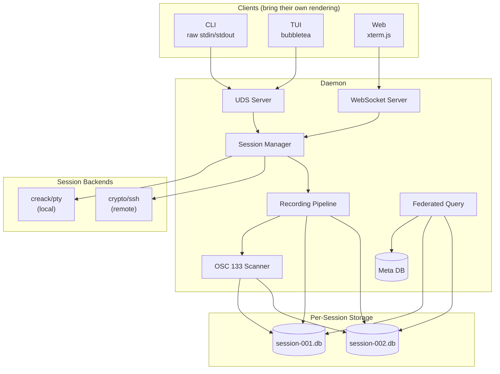

# Simplified Architecture — Recording Proxy Model

## Principle

The daemon is a **byte relay with a recording tap**. It never interprets terminal output. It never renders. It never maintains screen state. Clients bring their own terminal emulators.

```
User's Terminal ←→ Daemon (tee to SQLite) ←→ PTY ←→ Shell
                                           or
                                           ←→ SSH Channel ←→ Remote Shell
```

---

## Component Architecture



---

## Session Lifecycle

### Local Session

```go
func (m *Manager) StartLocal(profile Profile) (*Session, error) {
    // 1. Provision per-session SQLite DB
    db := database.NewSessionDB(uuid.New())

    // 2. Build shell command with OSC 133 hooks
    cmd := exec.Command("bash", "--rcfile", m.shellIntegration("bash"))
    cmd.Env = profile.InjectEnv(os.Environ()) // credentials from keyring

    // 3. Start in PTY
    ptmx, err := pty.Start(cmd)

    // 4. Create session with recording pipeline
    return &Session{
        id:       db.UUID,
        ptmx:     ptmx,
        cmd:      cmd,
        recorder: NewRecorder(db),
    }, nil
}
```

### Remote Session

```go
func (m *Manager) StartRemote(profile Profile) (*Session, error) {
    db := database.NewSessionDB(uuid.New())

    // 1. Dial SSH (respects ~/.ssh/config)
    client, err := ssh.Dial("tcp", profile.Host+":22", profile.SSHConfig())

    // 2. Open session, request PTY
    sshSession, _ := client.NewSession()
    sshSession.RequestPty("xterm-256color", 24, 80, defaultModes)

    // 3. Get I/O pipes
    stdin, _  := sshSession.StdinPipe()
    stdout, _ := sshSession.StdoutPipe()
    sshSession.Shell()

    // 4. Inject OSC 133 hooks as first command
    stdin.Write(m.shellIntegrationPayload(profile.RemoteShell))

    return &Session{
        id:       db.UUID,
        stdin:    stdin,
        stdout:   stdout,
        ssh:      sshSession,
        recorder: NewRecorder(db),
    }, nil
}
```

### Client Attach

When a client attaches to a session, the daemon wires up bidirectional byte relay with recording:

```go
func (s *Session) Attach(client io.ReadWriter) {
    // Output: backend → tee(recorder) → client
    tee := io.TeeReader(s.output(), s.recorder)
    go io.Copy(client, tee)

    // Input: client → backend (optionally record input too)
    io.Copy(s.input(), client)
}
```

- `s.output()` returns `ptmx` for local, `stdout` pipe for remote
- `s.input()` returns `ptmx` for local, `stdin` pipe for remote
- **Same code path for both.** The session type is invisible to the attach logic.

---

## Recording Pipeline

```go
type Recorder struct {
    db        *sql.DB
    oscParser *OSC133Scanner
    start     time.Time
    writeCh   chan Chunk  // buffered, async writes
}

type Chunk struct {
    Timestamp float64  // seconds since session start
    Data      []byte
    Zone      string   // "prompt", "input", "output", "end" (from OSC 133)
    ExitCode  *int     // populated on OSC 133;D
}

func (r *Recorder) Write(p []byte) (int, error) {
    elapsed := time.Since(r.start).Seconds()

    // Scan raw bytes for OSC 133 markers
    chunks := r.oscParser.Segment(p, elapsed)

    // Async send to writer goroutine (never block the PTY read)
    for _, c := range chunks {
        select {
        case r.writeCh <- c:
        default:
            // buffer full — shouldn't happen with reasonable sizing
        }
    }
    return len(p), nil
}

// Background goroutine: batches writes to SQLite
func (r *Recorder) writeLoop() {
    batch := make([]Chunk, 0, 64)
    ticker := time.NewTicker(100 * time.Millisecond)

    for {
        select {
        case c := <-r.writeCh:
            batch = append(batch, c)
            if len(batch) >= 64 {
                r.flushBatch(batch)
                batch = batch[:0]
            }
        case <-ticker.C:
            if len(batch) > 0 {
                r.flushBatch(batch)
                batch = batch[:0]
            }
        }
    }
}
```

No octal decoding. No VT parsing. Raw bytes in, timestamped chunks out.

---

## OSC 133 on Raw Streams

OSC 133 markers in raw bytes are just byte sequences:

```
Prompt start:  \x1b ] 1 3 3 ; A \x07
Input start:   \x1b ] 1 3 3 ; B \x07
Output start:  \x1b ] 1 3 3 ; C \x07
Command end:   \x1b ] 1 3 3 ; D ; <exit_code> \x07
```

The scanner is a simple state machine over the byte stream — no encoding/decoding layer. When a marker is found, the recorder tags subsequent chunks with the current semantic zone.

---

## tmux as Optional Persistence Layer

tmux is **not a dependency**. When the user wants session persistence (survive daemon restart, survive SSH drop), tmux is launched as the shell process inside the PTY:

```go
// Without persistence — plain shell
cmd := exec.Command("bash", "--rcfile", hooks)

// With persistence — tmux as the shell
cmd := exec.Command("tmux", "new-session", "-A", "-s", sessionName,
    "bash", "--rcfile", hooks)
```

From the daemon's perspective, nothing changes. It still owns the PTY master. It still tees the output. It doesn't speak Control Mode — tmux just runs normally inside the PTY. The user interacts with tmux through their terminal as usual.

For remote sessions with persistence:

```go
// SSH command runs tmux on the remote host
sshSession.Shell()
stdin.Write([]byte("tmux new-session -A -s " + sessionName + "\n"))
```

The daemon still records everything through the SSH channel. If SSH drops, the remote tmux session persists. The daemon reconnects SSH, reattaches tmux, and continues recording.

---

## Client Interfaces

### CLI — Direct Attach

The simplest interface. The daemon pipes the session's PTY to the CLI process's stdin/stdout over UDS. The user's terminal does all rendering.

```
$ ads start --profile staging-web     # creates session, attaches
$ ads list                            # shows active sessions
$ ads attach <session-id>             # reattaches
$ ads search "connection refused"     # FTS5 across all sessions
$ ads replay <session-id>             # plays back with timing
```

### TUI — Session Dashboard

bubbletea app that shows a session list, search interface, and can attach to sessions. When attached, the TUI hands off to raw mode and becomes a transparent pipe — the terminal renders the session output natively.

### Web — xterm.js Relay

The daemon opens a WebSocket for each session. xterm.js in the browser connects to it. The daemon relays bytes bidirectionally. **xterm.js is the terminal emulator** — the daemon sends raw bytes, xterm.js renders them. No server-side VT state needed.

```go
func (s *Session) HandleWebSocket(ws *websocket.Conn) {
    // Output: session → WebSocket (recorded by existing tee)
    go func() {
        buf := make([]byte, 4096)
        for {
            n, _ := s.output().Read(buf)
            ws.Write(buf[:n])
        }
    }()
    // Input: WebSocket → session
    for {
        _, msg, _ := ws.ReadMessage()
        s.input().Write(msg)
    }
}
```

> **Note:** With multiple clients attached, `s.output()` can't be read by two goroutines simultaneously. The session needs a broadcaster that reads once and fans out to all attached clients + the recorder. This is a small multiplexing layer — not a VT state machine.

---

## What This Architecture Looks Like in Packages

```
cmd/ads/main.go              # single binary: daemon + CLI

internal/
  daemon/
    daemon.go                 # lifecycle, UDS + HTTP servers
  session/
    manager.go                # create, list, attach, kill
    session.go                # unified session (local or remote)
    local.go                  # creack/pty backend
    remote.go                 # crypto/ssh backend
    broadcaster.go            # fan-out output to N clients + recorder
  recording/
    recorder.go               # io.Writer → batched SQLite
    osc133.go                 # byte-level OSC 133 scanner
    replay.go                 # playback with original timing
  database/
    meta.go                   # internal meta-DB
    session_db.go             # per-session DB provisioning
    federated.go              # cross-session queries
    fts.go                    # FTS5 search
  storage/
    interface.go              # read/write/list/delete
    local.go                  # filesystem
    s3.go                     # S3-compatible
    sftp.go                   # Hetzner Storage Boxes
  profile/
    profile.go                # server entities, credentials
    keyring.go                # OS keyring (go-keyring)
  shell/
    integration_bash.sh       # OSC 133 hooks
    integration_zsh.sh
    embed.go                  # go:embed
  tui/                        # bubbletea
  web/                        # HTTP + WebSocket + static assets
  plugin/                     # go-plugin (later phase)
  ansible/                    # ansible runner (later phase)
```

---

## Phased Delivery

| Phase | Scope | Weeks |
|---|---|---|
| **0: Spike** | PTY + recording + OSC 133 parsing in a single-file throwaway program | 1 |
| **1: Local sessions** | Daemon, session manager, local PTY, recorder, SQLite, CLI (start/list/attach/search/replay) | 3–4 |
| **2: Remote sessions** | crypto/ssh backend, profiles, keyring, SSH config parsing | 3 |
| **3: TUI + search** | bubbletea dashboard, FTS5 cross-session search, session tagging | 3 |
| **4: Web + storage** | WebSocket relay, xterm.js, storage abstraction, S3/Hetzner backends | 3–4 |
| **5: Plugins + services** | go-plugin, LLM RAG service, time tracking | 3–4 |
| **6: Containers + Ansible** | Podman integration, Ansible Runner | 3 |

---

## What's Gone

- tmux Control Mode client
- Octal encoder/decoder
- VT state machine
- send-keys input translation
- Flow control management (%pause/%continue)
- tmux as hard runtime dependency

## What Remains Simple

- `creack/pty` for local (3 lines)
- `crypto/ssh` + `RequestPty` for remote (10 lines)
- `io.TeeReader` for recording (1 line)
- OSC 133 scanning on raw bytes (state machine, ~100 lines)
- tmux as optional subprocess for persistence (1 line change to the shell command)
